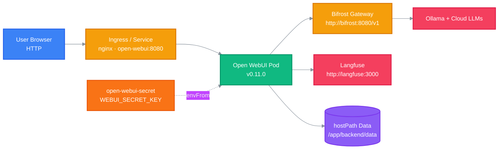

<h1 align="center">Open WebUI Deployment</h1>

<p align="center">
  <strong>Declarative Kubernetes deployment for the self-hosted Open WebUI chat interface on Kind.</strong>
  <br />
  <em>nginx ingress · Bifrost gateway · Langfuse observability · persistent hostPath storage</em>
</p>

<p align="center">
  <a href="#quick-start"></a>
  <a href="LICENSE"></a>
</p>

<p align="center">
  
  
  
  
  
  
  
</p>

This repository contains deployment manifests and runtime data for a containerized [Open WebUI](https://github.com/open-webui/open-webui) instance, the user-facing chat and agent interface for the **furseal** AI workspace. It is not the Open WebUI source code; there is no application code to build or test here.

## Features

| Feature | Description |
|---|---|
| Single authoritative manifest | Service, Deployment, and Ingress defined together in `k8s/open-webui-deployment.yaml` |
| Pinned upstream image | Runs `ghcr.io/open-webui/open-webui:v0.11.0` with `imagePullPolicy: Always` |
| Persistent state | Kind-node hostPath `/mnt/workspaces/open-webui/data` mounts to `/app/backend/data`, auto-provisioned via `DirectoryOrCreate` |
| Secret-backed configuration | `envFrom` injects `WEBUI_SECRET_KEY` from `open-webui-secret` |
| Ingress routing | nginx exposes both `open-webui.localhost` and `ai.furseal.net` |
| OpenAI-compatible gateway | Streaming completions and embeddings served through Bifrost at `http://bifrost:8080/v1` |
| LLM observability | Traces and evaluations forwarded to Langfuse at `http://langfuse:3000` |

## Quick Start

### Prerequisites

- A Kind Kubernetes cluster with the nginx ingress controller installed (Mac Studio)
- `kubectl` configured against the target context — manifests are namespace-less and deploy into the current context
- Bifrost gateway reachable at `http://bifrost:8080/v1`, Langfuse reachable at `http://langfuse:3000`

### Apply the Secret

```sh
# Deployment's envFrom references this explicitly; apply first or pods start without env vars
kubectl apply -f k8s/open-webui-secret.yaml
```

### Apply the Deployment

```sh
# Service + Deployment + Ingress are all defined in this single file
kubectl apply -f k8s/open-webui-deployment.yaml
```

### Initialize the Admin Account

On first boot visit `http://open-webui.localhost/auth/admin/setup` to create the initial administrator. In Admin Settings, configure the networking endpoint to `http://bifrost:8080/v1` and verify `/v1/models`, `/v1/chat/completions`, and `/v1/embeddings` resolve.

## Usage

### Follow Pod Logs

```sh
kubectl logs -f deploy/open-webui
```

### Roll Out Configuration Changes

```sh
kubectl rollout restart deployment open-webui
```

### Inspect Cluster Resources

```sh
kubectl get pods,svc,ingress,pvc
```

### Back Up Runtime State

```sh
rsync -av /mnt/workspaces/open-webui/data/ "/mnt/backups/open-webui-data-$(date +%F)/"
```

## Architecture



Open Web UI streams chat completions to the Bifrost gateway and forwards LLM traces to Langfuse for prompt logging, call tracing, and evaluation. All persistent state (SQLite database, vector index, caches, uploads) lives on the hostPath volume mounted at `/app/backend/data`.

## Configuration

Configuration is supplied through the `open-webui-secret` manifest, injected into the Deployment via `envFrom`. Generate your own values; never commit real keys.

| Variable | Description |
|---|---|
| `WEBUI_SECRET_KEY` | Session signing secret; rotating it invalidates active sessions |
| `LANGFUSE_PUBLIC_KEY` | Langfuse public API key, pasted in Admin Settings |
| `LANGFUSE_SECRET_KEY` | Langfuse secret API key, pasted in Admin Settings |
| `LANGFUSE_HOST` | Langfuse endpoint, `http://langfuse:3000` |

Runtime limits are declared in the Deployment spec: `requests.memory: 1024Mi`, `limits.memory: 4096Mi`.

## Project Structure

```
open-webui/
├── k8s/
│   ├── open-webui-deployment.yaml   # Service + Deployment + Ingress (authoritative)
│   └── open-webui-secret.yaml       # Secret: WEBUI_SECRET_KEY (git-ignored)
├── data/                            # hostPath runtime volume → /app/backend/data
│   ├── webui.db                     # SQLite database (profiles, chat history)
│   ├── vector_db/                   # embedding index
│   ├── cache/                       # model caches
│   └── uploads/                     # user-uploaded documents
├── AGENTS.md                        # maintainer notes for agent sessions
├── LICENSE                          # MIT license
└── README.md                        # this file
```

## Tech Stack

| Technology | Purpose |
|---|---|
| Kubernetes | Orchestration |
| Kind | Local cluster on the Mac Studio |
| Nginx | Ingress controller |
| Docker | Container runtime for the upstream image |
| Open WebUI | Self-hosted chat and agent interface (`v0.11.0`) |
| Bifrost | OpenAI-compatible gateway at `bifrost:8080/v1` |
| Ollama | Local model runtime |
| Langfuse | LLM observability and tracing |
| SQLite | Persistent application data |

## Deployment

### Apply Manifests

Secret first, then the combined Service/Deployment/Ingress file:

```sh
kubectl apply -f k8s/open-webui-secret.yaml
kubectl apply -f k8s/open-webui-deployment.yaml
```

No local build is required — the Deployment runs the published upstream image directly. After any manifest edit, validate before rollout:

```sh
kubectl apply --dry-run=client -o yaml -f k8s/
kubectl diff -f k8s/open-webui-deployment.yaml
```

### Notes

- `data/`, `*.log`, and `k8s/*-secret.yaml` are git-ignored by design; do not re-commit regenerated state.
- Manifests carry no namespace; they deploy into the current kubectl context (default: `default`).

## Contributing

1. Fork the repository
2. Create a feature branch (`git checkout -b feat/your-change`)
3. Commit your changes with a concise message
4. Push to the branch (`git push origin feat/your-change`)
5. Open a Pull Request

This repository holds deployment configuration, not application source; changes are expected to be manifest edits or documentation updates.

## License

[MIT](LICENSE)

<!-- BEAUTIFIED -->
